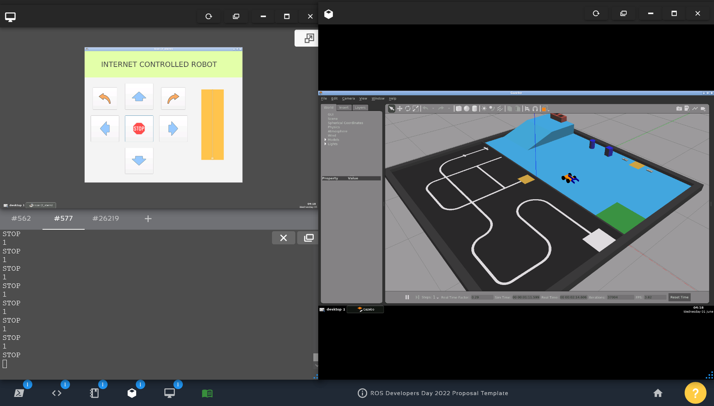
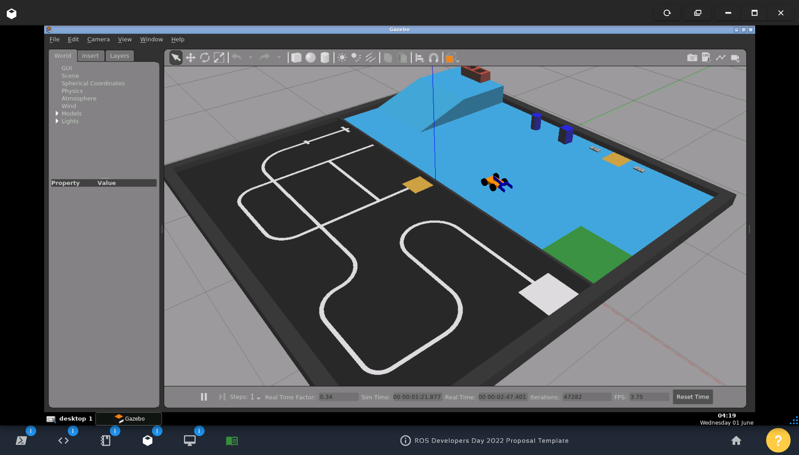
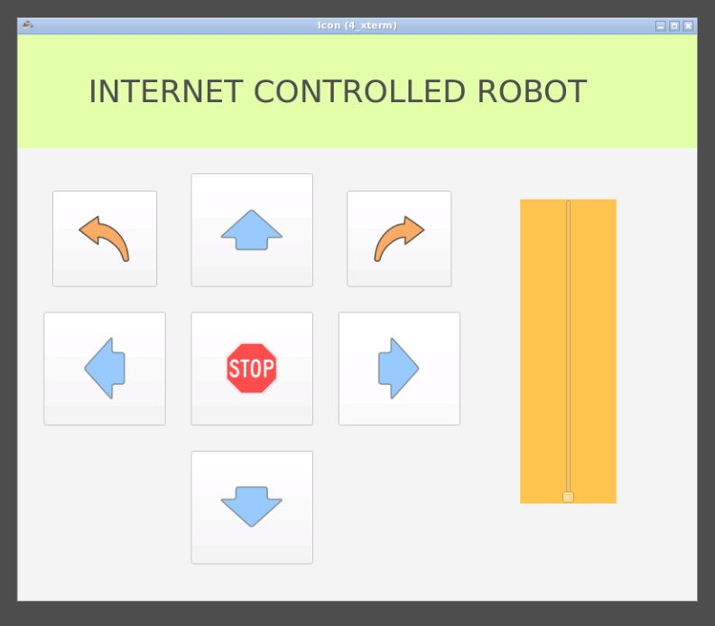
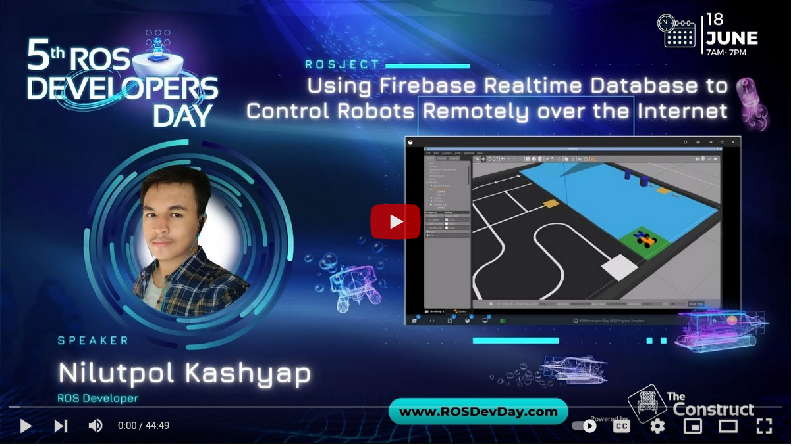

# ros_firebase_robot

# USING FIREBASE REALTIME DATABASE TO CONTROL ROBOTS REMOTELY OVER THE INTERNET 

 

## Presented project at 5th ROS Developers Day

Website - [5th ROSDevDay 2022](https://www.theconstructsim.com/ros-developers-day-2022)

 

 

## Project Demo

### Simulation

 

### GUI

 

## 5th ROS Developer's Day Video

 

